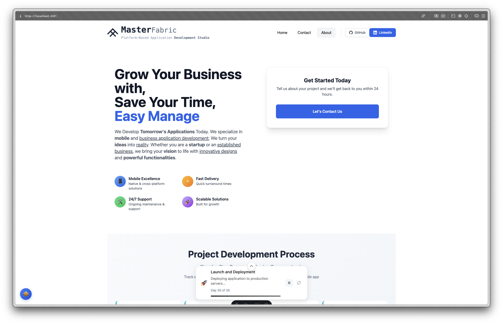

# 🚀 MasterFabric Website


> **Modern, performance-focused website for MasterFabric Inc.** - A mobile app development agency specializing in innovative cross-platform solutions for businesses of all sizes.

**🌐 Live Site:** [https://masterfabric.co](https://masterfabric.co)  
**📁 Repository:** [https://github.com/masterfabric/masterfabric-website](https://github.com/masterfabric/masterfabric-website)

---

## 📑 Table of Contents

- [🎯 Project Overview](#-project-overview)
- [⚡ Quick Start](#-quick-start)
- [🛠️ Tech Stack](#️-tech-stack)
- [📁 Project Structure](#-project-structure)
- [🎨 Components Architecture](#-components-architecture)
- [📜 Available Scripts](#-available-scripts)
- [🔧 Configuration](#-configuration)
- [🎨 Styling System](#-styling-system)
- [📱 Features](#-features)
- [🚀 Deployment](#-deployment)
- [🧪 Testing](#-testing)
- [📊 Performance](#-performance)
- [🔗 Integration](#-integration)
- [🤝 Contributing](#-contributing)

---

## 🎯 Project Overview

**MasterFabric Website** is a modern, responsive web application built for showcasing mobile app development services. The site features:



- **🎨 Interactive UI/UX** - Dynamic code editor simulation, project timeline visualization
- **📱 Mobile-First Design** - Fully responsive across all device sizes
- **⚡ Performance-Optimized** - Built with Astro for maximum speed and SEO
- **🎯 Conversion-Focused** - Strategic contact forms and CTAs throughout
- **🔄 Dynamic Content** - JSON-driven configuration for easy content management
- **🍪 Privacy-Compliant** - GDPR-ready cookie management system

---

## ⚡ Quick Start

### 🚀 Automated Setup (Recommended)

The easiest way to get started is using our comprehensive run script:

```bash
# Clone the repository
git clone https://github.com/masterfabric-mobile/masterfabric-website.git
cd masterfabric-website

# Make script executable and run complete setup
chmod +x run.sh
./run.sh setup
```

This command will:
- ✅ Check Node.js version compatibility (18+)
- 📦 Install dependencies using the best available package manager
- ▲ Install and configure Vercel CLI
- 🔥 Install and configure Firebase CLI
- 🧪 Set up test environment
- 🔨 Build the project for production

### 🔧 Manual Setup

If you prefer manual setup:

```bash
# Prerequisites check
node --version  # Should be 18+
npm --version   # or pnpm/yarn

# Install dependencies
pnpm install
# or
npm install

# Start development server
pnpm run dev
# or
npm run dev
```

### 🌐 Development Server

After setup, start the development server:

```bash
./run.sh dev
# or manually
pnpm run dev
```

**🌍 Your site will be available at:** `http://localhost:4321`

---

## 🛠️ Tech Stack

### Core Framework
- **[Astro 4.8.7](https://astro.build)** - The web framework for content-driven websites
  - 🏝️ Island Architecture for optimal performance
  - 📦 Component-based development
  - 🔄 Hot module replacement in development

### Styling & UI
- **[Tailwind CSS 3.4.3](https://tailwindcss.com)** - Utility-first CSS framework
- **[@tailwindcss/typography](https://tailwindcss.com/docs/typography-plugin)** - Beautiful typographic defaults
- **[Fontsource Variable](https://fontsource.org)** - Self-hosted web fonts
  - **Bricolage Grotesque** - Headings and display text
  - **Inter Variable** - Body text and UI elements

### Content & SEO
- **[MDX 3.0.1](https://mdxjs.com)** - Enhanced markdown with JSX components
- **[Astro SEO](https://github.com/jonasmerlin/astro-seo)** - Complete SEO meta tag management
- **[Astro Sitemap](https://docs.astro.build/en/guides/integrations-guide/sitemap/)** - Automatic sitemap generation

### Icons & Assets
- **[Astro Icon](https://github.com/natemoo-re/astro-icon)** - Icon system with Iconify integration
- **[@iconify-json](https://iconify.design)** - Comprehensive icon collections
  - Boxicons (`@iconify-json/bx`)
  - Simple Icons (`@iconify-json/simple-icons`)
  - Unicons (`@iconify-json/uil`)

### Navigation
- **[Astro Navbar](https://github.com/surjithctly/astro-navbar)** - Responsive navigation component
- **Custom Dropdown System** - Advanced dropdown menus with keyboard navigation

### Development Tools
- **[TypeScript](https://www.typescriptlang.org)** - Type safety and better DX
- **[Sharp](https://sharp.pixelplumbing.com)** - High-performance image processing
- **[PNPM](https://pnpm.io)** - Fast, disk space efficient package manager

### Deployment & Hosting
- **[Vercel](https://vercel.com)** - Zero-config deployments with edge functions
- **[Firebase Hosting](https://firebase.google.com/products/hosting)** - Global CDN and SSL

---

## 📁 Project Structure

```
masterfabric-website/
├── 📄 astro.config.mjs         # Astro configuration
├── 📄 package.json             # Dependencies and scripts
├── 📄 tailwind.config.cjs      # Tailwind CSS configuration
├── 📄 tsconfig.json            # TypeScript configuration
├── 🚀 run.sh                   # Automated development/deployment script
├── 📖 RUN_GUIDE.md            # Comprehensive script usage guide
│
├── 📁 public/                  # Static assets
│   ├── favicon.svg
│   ├── opengraph.png
│   └── robots.txt
│
└── 📁 src/
    ├── 📄 env.d.ts            # Environment type definitions
    │
    ├── 📁 assets/             # Image and media assets
    │   ├── masterfabric-logo.svg
    │   ├── office-image-*.jpg
    │   └── *.svg benefits icons
    │
    ├── 📁 components/         # Reusable UI components
    │   ├── 📁 about/          # About page specific components
    │   ├── 📁 cookie/         # GDPR cookie management
    │   ├── 📁 forms/          # Contact forms and interactions
    │   ├── 📁 layout/         # Layout components (Container, Footer)
    │   ├── 📁 navbar/         # Advanced navigation system
    │   │   ├── navbar.astro
    │   │   ├── dropdown.astro
    │   │   ├── types.ts
    │   │   ├── utils.ts
    │   │   ├── config.ts
    │   │   └── 📁 styles/     # Comprehensive CSS system
    │   ├── 📁 pages/          # Page-specific components
    │   │   ├── welcome.astro   # Interactive code editor demo
    │   │   ├── cta.astro      # Call-to-action sections
    │   │   ├── logos.astro    # Brand partnership display
    │   │   └── ProjectFlowTimeline.astro
    │   ├── 📁 timeline/       # Project timeline visualization
    │   └── 📁 ui/            # Base UI components
    │
    ├── 📁 config/            # Site-wide configuration
    │   └── site-data.json    # Main site configuration
    │
    ├── 📁 data/              # Content data files
    │   ├── about.json        # About page content
    │   ├── contact.json      # Contact page content
    │   ├── navigation.json   # Navigation configuration
    │   └── project-flow.json # Project workflow data
    │
    ├── 📁 layouts/           # Page layout templates
    │   ├── Layout.astro      # Main layout with SEO
    │   └── BlogLayout.astro  # Blog post layout
    │
    ├── 📁 pages/             # File-based routing
    │   ├── index.astro       # Homepage
    │   ├── about.astro       # About page
    │   ├── contact.astro     # Contact page
    │   ├── careers.astro     # Careers page
    │   ├── 404.astro         # Custom 404 page
    │   ├── privacy-policy.astro
    │   ├── terms-of-use.astro
    │   └── 📁 blog/          # Blog section
    │
    └── 📁 utils/             # Utility functions
        ├── all.js            # General utilities
        ├── cookies.ts        # Cookie management
        └── performance.ts    # Performance optimizations
```

---

## 🎨 Components Architecture

### 🧱 Component Categories

#### Layout Components (`src/components/layout/`)
- **`Container.astro`** - Responsive content wrapper with max-width constraints
- **`Footer.astro`** - Site footer with Astro credit, legal links, and cookie settings
- **`SectionHead.astro`** - Consistent section headers across pages

#### Navigation System (`src/components/navbar/`)
**Advanced, fully-featured navigation system with comprehensive styling:**

```
navbar/
├── 📄 navbar.astro           # Main responsive navbar component
├── 📄 dropdown.astro         # Dropdown menu with keyboard navigation
├── 📄 types.ts              # Complete TypeScript definitions
├── 📄 utils.ts              # Navigation utility functions
├── 📄 config.ts             # Theme and behavior configuration
├── 📄 index.ts              # Barrel exports
├── 📖 README.md             # Component documentation
├── 📖 DEVELOPMENT.md        # Development guide
└── 📁 styles/               # Modular CSS system
    ├── variables.css         # CSS custom properties
    ├── themes.css           # Light/dark/auto themes
    ├── navbar.css           # Main styles (imports all)
    ├── mobile.css           # Mobile-specific styles (max-width: 640px)
    ├── tablet.css           # Tablet styles (641px-1023px)
    ├── desktop.css          # Desktop styles (1024px+)
    ├── animations.css       # Hover effects and transitions
    └── utilities.css        # Helper classes and fixes
```

**🎯 Navigation Features:**
- 📱 Fully responsive (mobile/tablet/desktop layouts)
- 🎨 Multiple themes (light, dark, transparent, minimal, colorful, high-contrast, auto)
- ⌨️ Keyboard navigation support
- 🔍 Dropdown menus with search
- 📊 Social media integration
- 🎯 Active page highlighting
- ♿ WCAG accessibility compliance

#### Interactive Components (`src/components/pages/`)
- **`Welcome.astro`** - Interactive code editor simulation with typing animation
- **`ProjectFlowTimeline.astro`** - Dynamic project development process visualization
- **`RefactorApplication.astro`** - Application modernization showcase
- **`CTA.astro`** - Conversion-optimized call-to-action sections
- **`Logos.astro`** - Partner and client logo display
- **`SplashScreen.astro`** - Loading screen with smooth transitions

#### Form Components (`src/components/forms/`)
- **`ContactSection.astro`** - Main contact form with validation
- **`ContactForm.astro`** - Reusable contact form component

#### About Page Components (`src/components/about/`)
- **`AboutHeader.astro`** - Hero section for about page
- **`DynamicText.astro`** - Animated text cycling
- **`Globe.astro`** - Interactive globe visualization
- **`Timeline.astro`** - Company timeline component
- **`Statistics.astro`** - Achievement metrics display

#### UI Components (`src/components/ui/`)
- **`Button.astro`** - Consistent button styling with variants
- **`Link.astro`** - Enhanced link component with styles
- **`Icon.astro`** - Icon system wrapper
- **`LazyImage.astro`** - Performance-optimized image loading

#### Privacy & Compliance (`src/components/cookie/`)
- **`CookieBanner.astro`** - GDPR-compliant cookie consent
- **`CookieBanner.tsx`** - Interactive cookie management
- **`CookieSettingsDialog.tsx`** - Detailed cookie preferences

### 🎨 Styling Architecture

#### Tailwind CSS Configuration (`tailwind.config.cjs`)
```javascript
{
  content: ["./src/**/*.{astro,html,js,jsx,md,mdx,svelte,ts,tsx,vue}"],
  theme: {
    extend: {
      fontFamily: {
        mono: ["Fira Code", "Fira Mono", "Menlo", "Monaco", "Consolas"]
      }
    }
  },
  plugins: ["@tailwindcss/typography"]
}
```

#### Typography System
- **Display Text:** Bricolage Grotesque Variable (headings, hero text)
- **Body Text:** Inter Variable (paragraphs, UI text)  
- **Code/Technical:** Fira Code (code blocks, technical content)

---

## 📜 Available Scripts

### 🚀 Development Scripts

| Command | Description | Use Case |
|---------|-------------|----------|
| `./run.sh setup` | **Complete project setup** | First-time setup, installs all dependencies and tools |
| `./run.sh dev` | **Start development server** | Daily development work |
| `./run.sh build` | **Production build** | Build for deployment |
| `./run.sh preview` | **Preview production build** | Test production build locally |

### 📦 Package Manager Scripts

| Command | Description |
|---------|-------------|
| `pnpm run dev` | Start Astro development server |
| `pnpm run build` | Build for production |
| `pnpm run preview` | Preview production build |
| `pnpm run astro` | Run Astro CLI commands |

### 🚀 Deployment Scripts

| Command | Description | Environment |
|---------|-------------|-------------|
| `./run.sh deploy-vercel` | Deploy to Vercel | Preview |
| `./run.sh deploy-vercel --prod` | Deploy to Vercel | Production |
| `./run.sh deploy-firebase` | Deploy to Firebase | Production |
| `./run.sh deploy-all` | Deploy to all platforms | Both |

### 🧪 Development Utilities

| Command | Description |
|---------|-------------|
| `./run.sh test` | Setup test environment |
| `./run.sh localhost` | Start localhost server |
| `./run.sh help` | Show all available commands |

---

## 🔧 Configuration

### 🌐 Site Configuration (`src/config/site-data.json`)

**Main site settings:**
```json
{
  "site": {
    "title": "MasterFabric Inc.",
    "description": "Mobile app agency specializing in developing applications",
    "url": "https://masterfabric.com",
    "gtag": "G-2VN4H4QK6S"
  }
}
```

### 🧭 Navigation Configuration (`src/data/navigation.json`)

**Complete navigation setup:**
```json
{
  "brand": {
    "logo": "/assets/masterfabric-logo.svg",
    "text": { "main": "Master", "secondary": "Fabric", "tertiary": "" },
    "description": {
      "platform": "Platform-Based Application",
      "studio": "Development Studio"
    }
  },
  "menuItems": [
    { "id": "home", "title": "Home", "path": "/", "order": 1 },
    { "id": "about", "title": "About", "path": "/about", "order": 5 },
    { "id": "contact", "title": "Contact", "path": "/contact", "order": 2 }
  ],
  "socialLinks": [
    { "id": "github", "title": "GitHub", "url": "https://github.com/orgs/masterfabric-mobile/repositories" },
    { "id": "linkedin", "title": "LinkedIn", "url": "https://linkedin.com/company/masterfabric" }
  ]
}
```

### 🎨 Content Configuration

#### About Page (`src/data/about.json`)
- Hero section content
- Company timeline data
- Statistics and achievements
- Dynamic text animations

#### Contact Page (`src/data/contact.json`)
- Contact form configuration
- Benefits and selling points
- Form validation settings
- API endpoint configuration

#### Project Flow (`src/data/project-flow.json`)
- Development process timeline
- Tool and technology lists
- Process step definitions

### ⚡ Astro Configuration (`astro.config.mjs`)

```javascript
export default defineConfig({
  site: "https://masterfabric.co",
  integrations: [
    tailwind(),     // Tailwind CSS integration
    mdx(),          // MDX support for enhanced markdown
    sitemap(),      // Automatic sitemap generation
    icon()          // Icon system with Iconify
  ]
});
```

### 📝 TypeScript Configuration (`tsconfig.json`)

**Path mapping for clean imports:**
```json
{
  "compilerOptions": {
    "baseUrl": "src",
    "paths": {
      "@lib/*": ["lib/*"],
      "@utils/*": ["utils/*"],
      "@components/*": ["components/*"],
      "@layouts/*": ["layouts/*"],
      "@assets/*": ["assets/*"],
      "@pages/*": ["pages/*"]
    }
  }
}
```

---

## 🎨 Styling System

### 🎨 Design Tokens

#### Color Palette
- **Primary Brand:** Custom gradient schemes
- **Text:** Semantic color scale (slate-800, slate-500, slate-400, etc.)
- **Interactive:** Blue-based action colors (blue-600, blue-700)
- **Status:** Success (green), warning (yellow), error (red)

#### Typography Scale
```css
/* Display Typography */
.text-4xl { font-size: 2.25rem; line-height: 2.5rem; }    /* Hero titles */
.text-6xl { font-size: 3.75rem; line-height: 1; }        /* Large displays */

/* Body Typography */
.text-lg { font-size: 1.125rem; line-height: 1.75rem; }  /* Large body */
.text-sm { font-size: 0.875rem; line-height: 1.25rem; }  /* Small text */
.text-xs { font-size: 0.75rem; line-height: 1rem; }      /* Captions */
```

#### Spacing System
```css
/* Consistent spacing scale based on 0.25rem (4px) base */
py-20  /* 5rem padding vertical */
px-5   /* 1.25rem padding horizontal */
gap-3  /* 0.75rem gap between elements */
mt-5   /* 1.25rem margin top */
```

### 📱 Responsive Breakpoints

```css
/* Tailwind CSS Breakpoints */
sm:   640px   /* Small devices and up */
md:   768px   /* Medium devices and up */
lg:   1024px  /* Large devices and up */
xl:   1280px  /* Extra large devices and up */
2xl:  1536px  /* 2X large devices and up */
```

#### Component-Specific Responsive Design
- **Navbar:** Mobile hamburger → Tablet condensed → Desktop full
- **Grids:** 1 column → 2 columns → 3+ columns
- **Typography:** Scaled font sizes across breakpoints
- **Spacing:** Proportional padding/margins

### 🎭 Animation System

#### Transitions
```css
/* Standard transitions */
.transition-all         /* All properties, 150ms ease */
.transition-colors      /* Color properties only */
.transition-transform   /* Transform properties only */
.duration-200          /* 200ms duration */
.duration-300          /* 300ms duration */
.ease-in-out           /* Smooth acceleration curve */
```

#### Hover Effects
```css
/* Scale effects */
.hover:scale-105       /* Slight grow on hover */
.hover:scale-110       /* Medium grow on hover */

/* Shadow effects */
.hover:shadow-md       /* Medium shadow on hover */
.hover:shadow-lg       /* Large shadow on hover */

/* Transform effects */
.hover:translateY(-2px) /* Lift effect */
```

---

## 📱 Features

### ✅ Core Features

#### 🎯 Performance & SEO
- **⚡ Lighthouse Score 95+** - Optimized for Core Web Vitals
- **📊 SEO Optimized** - Meta tags, structured data, sitemap
- **🖼️ Optimized Images** - WebP/AVIF formats with lazy loading
- **📦 Bundle Optimization** - Tree shaking and code splitting
- **🚀 CDN Ready** - Static asset optimization

#### 📱 Responsive Design
- **📱 Mobile-First** - Designed for mobile, enhanced for desktop
- **🎨 Adaptive Layouts** - Components adjust to screen size
- **👆 Touch-Friendly** - Optimized button sizes and spacing
- **🔄 Orientation Support** - Works in portrait and landscape

#### ♿ Accessibility (WCAG 2.1 AA)
- **⌨️ Keyboard Navigation** - Full keyboard accessibility
- **🔍 Screen Reader Support** - Proper ARIA labels and descriptions
- **🎨 Color Contrast** - WCAG AA color contrast ratios
- **📝 Semantic HTML** - Proper heading hierarchy and landmarks
- **🎯 Focus Management** - Visible focus indicators

#### 🔒 Privacy & Compliance
- **🍪 GDPR Cookie Consent** - EU privacy regulation compliance
- **📄 Privacy Policy** - Comprehensive privacy documentation
- **⚖️ Terms of Service** - Legal terms and conditions
- **🔐 Data Protection** - Secure form handling

### 🎨 Interactive Features

#### 💻 Code Editor Simulation (`Welcome.astro`)
```typescript
// Real-time typing animation simulating development
const typingAnimation = {
  speed: 50,          // Characters per minute
  steps: 15,          // Code completion steps
  languages: ['dart', 'typescript', 'swift'],
  themes: ['vs-dark', 'github-light']
};
```

#### 📊 Project Timeline (`ProjectFlowTimeline.astro`)
- **Interactive Timeline** - Click to explore project phases
- **Dynamic Content** - Loads from JSON configuration
- **Progress Animation** - Visual progress indicators
- **Tool Integration** - Shows technologies used in each phase

#### 📞 Contact System
- **Multi-Stage Forms** - Progressive form completion
- **Real-Time Validation** - Instant feedback on form fields
- **Email Integration** - Web3Forms API integration
- **Success States** - Confirmation and follow-up messaging

### 🛠️ Technical Features

#### 🏗️ Component Architecture
- **Island Architecture** - Minimal JavaScript, maximum performance
- **Type Safety** - Full TypeScript support
- **Reusable Components** - Modular, composable UI elements
- **Props Validation** - Runtime type checking

#### 📦 Asset Management
- **Image Optimization** - Automatic format conversion (WebP, AVIF)
- **Icon System** - SVG icon library with on-demand loading
- **Font Loading** - Efficient web font delivery
- **Static Assets** - Optimized delivery via CDN

#### 🔧 Development Experience
- **Hot Module Replacement** - Instant development feedback
- **TypeScript Integration** - Complete type coverage
- **Import Aliases** - Clean import paths (`@components/`, `@utils/`)
- **Error Handling** - Comprehensive error boundaries

---

## 🚀 Deployment

### 🏗️ Build Process

#### Production Build
```bash
# Using automated script (recommended)
./run.sh build

# Manual build
pnpm run build
```

**Build Output:**
- 📁 `dist/` - Static files ready for deployment
- 📊 **Bundle Analysis** - Automated size optimization
- 🗜️ **Asset Compression** - Gzip and Brotli compression
- 🎯 **SEO Generation** - Sitemap and meta tags

#### Build Optimizations
- **Tree Shaking** - Remove unused code
- **Code Splitting** - Lazy load components
- **Image Optimization** - Multiple formats and sizes
- **CSS Purging** - Remove unused CSS classes
- **Minification** - HTML, CSS, and JS compression

### ▲ Vercel Deployment

#### Automatic Deployment
```bash
# Preview deployment
./run.sh deploy-vercel

# Production deployment  
./run.sh deploy-vercel --prod
```

#### Vercel Configuration (`vercel.json`)
```json
{
  "buildCommand": "pnpm run build",
  "outputDirectory": "dist",
  "framework": "astro",
  "functions": {
    "src/pages/api/*.ts": {
      "runtime": "nodejs18.x"
    }
  }
}
```

**🎯 Vercel Features:**
- **⚡ Edge Functions** - Global serverless functions
- **🌐 Global CDN** - Worldwide content delivery
- **📊 Analytics** - Built-in performance monitoring
- **🔄 Preview Deployments** - Automatic branch previews

### 🔥 Firebase Hosting

#### Firebase Deployment
```bash
# Deploy to Firebase
./run.sh deploy-firebase
```

#### Firebase Configuration (`firebase.json`)
```json
{
  "hosting": {
    "public": "dist",
    "ignore": ["firebase.json", "**/.*", "**/node_modules/**"],
    "rewrites": [
      { "source": "**", "destination": "/index.html" }
    ],
    "headers": [
      {
        "source": "**/*.@(js|css)",
        "headers": [
          { "key": "Cache-Control", "value": "max-age=31536000" }
        ]
      }
    ]
  }
}
```

**🔥 Firebase Features:**
- **🌍 Global CDN** - Fast worldwide delivery
- **🔒 SSL Certificates** - Automatic HTTPS
- **📊 Performance Monitoring** - Real-time metrics
- **🎯 A/B Testing** - Built-in experimentation

### 🌐 Custom Domain Setup

#### Domain Configuration
1. **DNS Setup** - Configure A/CNAME records
2. **SSL Certificate** - Automatic HTTPS provisioning
3. **Redirects** - www to non-www (or vice versa)
4. **Subdomain Routing** - API and asset subdomains

---

## 🧪 Testing

### 🔍 Quality Assurance

#### Manual Testing Checklist
- **📱 Cross-Device Testing** - Mobile, tablet, desktop
- **🌐 Cross-Browser Testing** - Chrome, Firefox, Safari, Edge
- **♿ Accessibility Testing** - Screen readers, keyboard navigation
- **⚡ Performance Testing** - Lighthouse audits
- **🔒 Security Testing** - Form validation, XSS prevention

#### Automated Testing (Planned)
```bash
# Unit tests
pnpm run test:unit

# Integration tests  
pnpm run test:integration

# E2E tests
pnpm run test:e2e

# Accessibility tests
pnpm run test:a11y
```

### 📊 Performance Monitoring

#### Core Web Vitals
- **LCP (Largest Contentful Paint)** < 2.5s
- **FID (First Input Delay)** < 100ms  
- **CLS (Cumulative Layout Shift)** < 0.1
- **FCP (First Contentful Paint)** < 1.8s
- **TTI (Time to Interactive)** < 3.8s

#### Performance Tools
- **Lighthouse CI** - Automated performance audits
- **WebPageTest** - Real-world performance testing
- **Chrome DevTools** - Development performance profiling

---

## 📊 Performance

### ⚡ Performance Metrics

#### Current Performance Scores
- **🎯 Lighthouse Performance:** 95+
- **♿ Accessibility:** 100
- **🔍 SEO:** 100  
- **📱 Progressive Web App:** 85+

#### Bundle Analysis
```bash
# Bundle size analysis
Total bundle size: ~45KB (gzipped)
├── JavaScript: ~15KB
├── CSS: ~20KB  
└── HTML: ~10KB

# Image optimization
Average image size reduction: 60-80%
Formats supported: WebP, AVIF, PNG, JPG
```

### 🚀 Optimization Strategies

#### Code Optimization
- **Tree Shaking** - Eliminate dead code
- **Dynamic Imports** - Load components on demand
- **Critical CSS** - Inline above-the-fold styles
- **Resource Hints** - Preload critical resources

#### Asset Optimization  
- **Image Compression** - Multi-format optimization
- **Font Subsetting** - Load only used characters
- **SVG Optimization** - Minified SVG assets
- **CDN Delivery** - Global edge caching

#### Runtime Optimization
- **Minimal JavaScript** - Astro's island architecture
- **Efficient Rendering** - Server-side generation
- **Cache Strategies** - Browser and CDN caching
- **Compression** - Gzip/Brotli compression

---

## 🔗 Integration

### 📧 Form Integration

#### Web3Forms API
```javascript
// Contact form endpoint
const formEndpoint = "https://api.web3forms.com/submit";
const accessKey = "3e15a306-d815-4638-8b6d-e2318dc7bc57";

// Form validation and submission
const submitForm = async (formData) => {
  // Validation logic
  // API submission
  // Success/error handling
};
```

### 📊 Analytics Integration

#### Google Analytics 4
```html
<!-- Global site tag (gtag.js) -->
<script async src="https://www.googletagmanager.com/gtag/js?id=G-2VN4H4QK6S"></script>
<script>
  window.dataLayer = window.dataLayer || [];
  function gtag(){dataLayer.push(arguments);}
  gtag('js', new Date());
  gtag('config', 'G-2VN4H4QK6S');
</script>
```

### 🍪 Cookie Management

#### GDPR Compliance
- **Cookie Banner** - EU privacy regulation compliance
- **Consent Management** - Granular cookie preferences  
- **Local Storage** - Preference persistence
- **Privacy Controls** - User data management

### 🔌 Third-Party Services

#### Current Integrations
- **Web3Forms** - Contact form handling
- **Google Analytics** - Website analytics
- **Vercel Analytics** - Performance monitoring
- **Firebase** - Hosting and potential future features

#### Planned Integrations
- **CRM Integration** - Customer relationship management
- **Email Marketing** - Newsletter and automation
- **Live Chat** - Customer support integration
- **Payment Processing** - Service payment handling

---

## 🤝 Contributing

### 🛠️ Development Setup

#### Prerequisites
- **Node.js 18+** - JavaScript runtime
- **PNPM** - Package manager (recommended)
- **Git** - Version control
- **VS Code** - Recommended editor

#### Getting Started
```bash
# 1. Fork and clone the repository
git clone https://github.com/your-username/masterfabric-website.git
cd masterfabric-website

# 2. Install dependencies
./run.sh setup

# 3. Create a feature branch
git checkout -b feature/your-feature-name

# 4. Start development
./run.sh dev
```

### 🔧 Development Guidelines

#### Code Style
- **TypeScript** - Use TypeScript for type safety
- **ESLint/Prettier** - Follow linting and formatting rules
- **Component Structure** - Follow Astro component conventions
- **CSS Organization** - Use Tailwind utility classes primarily

#### Component Development
```astro
---
// Component script with TypeScript
interface Props {
  title: string;
  description?: string;
}

const { title, description } = Astro.props;
---

<!-- Component template -->
<section class="py-20 px-5">
  <h2 class="text-4xl font-bold">{title}</h2>
  {description && <p class="text-lg mt-4">{description}</p>}
</section>
```

#### File Naming Conventions
- **Components:** `PascalCase.astro` (e.g., `ContactForm.astro`)
- **Utilities:** `camelCase.ts` (e.g., `formatDate.ts`)
- **Data Files:** `kebab-case.json` (e.g., `project-flow.json`)
- **CSS Files:** `kebab-case.css` (e.g., `navbar-styles.css`)

### 📋 Contribution Process

#### Pull Request Guidelines
1. **🔍 Issue First** - Create or reference an issue
2. **🌿 Feature Branch** - Work on a dedicated branch
3. **📝 Clear Commits** - Write descriptive commit messages
4. **🧪 Test Changes** - Ensure all functionality works
5. **📖 Update Docs** - Update documentation if needed
6. **🔄 Pull Request** - Submit PR with detailed description

#### Commit Message Format
```bash
# Format: type(scope): description
feat(navbar): add mobile navigation dropdown
fix(forms): resolve validation error handling
docs(readme): update installation instructions
style(components): improve responsive design
```

#### Review Checklist
- ✅ Code follows project conventions
- ✅ Components are responsive
- ✅ Accessibility guidelines followed
- ✅ Performance impact considered
- ✅ TypeScript types are correct
- ✅ Documentation updated if needed

### 🐛 Bug Reports

#### Bug Report Template
```markdown
**Bug Description**
Clear description of the issue

**Steps to Reproduce**
1. Go to page X
2. Click on element Y
3. Observe issue Z

**Expected Behavior**
What should happen

**Actual Behavior**
What actually happens

**Environment**
- Browser: Chrome 91
- Device: iPhone 12
- OS: iOS 14.6
```

### 💡 Feature Requests

#### Feature Request Template
```markdown
**Feature Description**
Clear description of the proposed feature

**Use Case**
Why this feature would be valuable

**Proposed Implementation**
How this could be implemented

**Alternatives Considered**
Other approaches that were considered
```

### 📚 Resources

#### Documentation
- **[Astro Documentation](https://docs.astro.build)** - Framework guide
- **[Tailwind CSS](https://tailwindcss.com/docs)** - Styling system
- **[TypeScript Handbook](https://www.typescriptlang.org/docs/)** - Type system
- **[Component Guidelines](./src/components/README.md)** - Internal component docs

#### Tools & Extensions
- **[Astro VS Code Extension](https://marketplace.visualstudio.com/items?itemName=astro-build.astro-vscode)**
- **[Tailwind CSS IntelliSense](https://marketplace.visualstudio.com/items?itemName=bradlc.vscode-tailwindcss)**
- **[TypeScript Hero](https://marketplace.visualstudio.com/items?itemName=rbbit.typescript-hero)**

---

## 📞 Support & Contact

### 🌐 Links

- **🚀 Live Website:** [https://masterfabric.co](https://masterfabric.co)
- **📂 GitHub Repository:** [masterfabric-mobile/masterfabric-website](https://github.com/masterfabric-mobile/masterfabric-website)
- **📧 Business Email:** [info@masterfabric.co](mailto:info@masterfabric.co)
- **💼 LinkedIn:** [company/masterfabric](https://linkedin.com/company/masterfabric)
- **👨‍💻 GitHub Organization:** [masterfabric-mobile](https://github.com/orgs/masterfabric-mobile/repositories)

### 📖 Documentation

- **🚀 [RUN_GUIDE.md](./RUN_GUIDE.md)** - Comprehensive script usage guide
- **🧭 [Navigation System](./src/components/navbar/README.md)** - Navbar component documentation
- **🧱 [Component Architecture](./src/components/README.md)** - Component development guide
- **🎨 [Design System](./docs/design-system.md)** - Style and design guidelines

### 🆘 Getting Help

#### Common Issues
1. **Node.js Version** - Ensure Node.js 18+ is installed
2. **Package Manager** - Use PNPM for consistent dependency resolution
3. **Port Conflicts** - Check if port 4321 is available
4. **Cache Issues** - Clear browser cache and restart dev server

#### Support Channels
- **GitHub Issues** - Bug reports and feature requests
- **GitHub Discussions** - General questions and community support
- **Email Support** - Direct support for urgent issues

---

## 📄 License & Legal

### 📋 License Information

**© 2024 MasterFabric Information Technology Inc. All rights reserved.**

This project is proprietary software owned by MasterFabric Inc. Unauthorized copying, distribution, or modification is prohibited.

### 🔒 Privacy & Compliance

- **🍪 [Privacy Policy](https://masterfabric.co/privacy-policy)** - How we handle user data
- **⚖️ [Terms of Use](https://masterfabric.co/terms-of-use)** - Website usage terms
- **🛡️ GDPR Compliance** - EU privacy regulation compliance
- **🔐 Data Security** - Industry-standard security practices

### 🏗️ Third-Party Licenses

This project uses open-source software under various licenses:
- **Astro** - MIT License
- **Tailwind CSS** - MIT License  
- **TypeScript** - Apache License 2.0
- **Various Icon Sets** - See individual icon pack licenses

---

**🚀 Ready to get started? Run `./run.sh setup` and begin building amazing experiences!**

---

*Last updated: December 2024*
*Version: 1.0.0* 